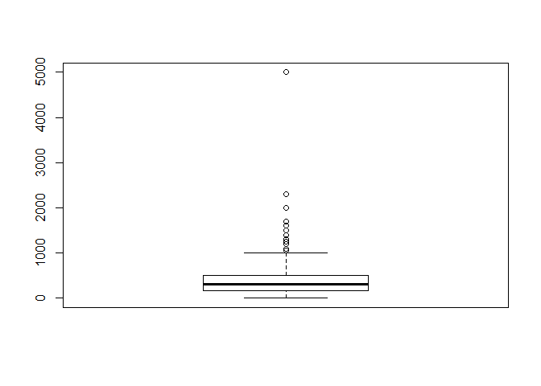
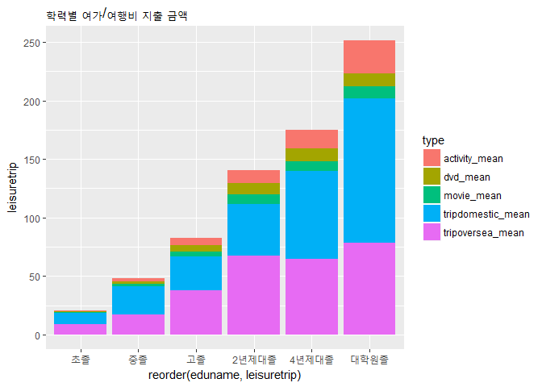

Untitled
================

``` r
library("dplyr")
```

    ## 
    ## Attaching package: 'dplyr'

    ## The following objects are masked from 'package:stats':
    ## 
    ##     filter, lag

    ## The following objects are masked from 'package:base':
    ## 
    ##     intersect, setdiff, setequal, union

``` r
library("ggplot2")
data <- read.csv("NaSTaB09H.csv")
# h09ca001 = 경상소득
# h1-1. (1) h09ch001 / (2) h09ch002
# h1-2. (1) h09ch003 / (2) h09ch004
# h1-3. (1) h09ch005 / (2) h09ch006
# h1-6. (1) h09ch012 / (2) h09ch013
# n1-1. (1) h09cn001 / (2) h09cn002

# 1. 알아보기 쉽도록 변수명 바꾸기
data <- rename(data, income = h09ca001)
data <- rename(data, dvd_spend_yesno = h09ch001)
data <- rename(data, dvd_spend = h09ch002)
data <- rename(data, movie_spend_yesno = h09ch003)
data <- rename(data, movie_spend = h09ch004)
data <- rename(data, race_spend_yesno = h09ch005)
data <- rename(data, race_spend = h09ch006)
data <- rename(data, activity_spend_yesno = h09ch012)
data <- rename(data, activity_spend = h09ch013)
data <- rename(data, trip_spend_yesno = h09cn001)
data <- rename(data, trip_spend = h09cn002)
data <- rename(data, member_n = h09aa007)
data <- rename(data, member_income = h09aa008)


# 2-1. h1_1 '서적, 음반, DVD 등 구입 및 대여료' 문항 지출여부에 '예'라고 답한사람들의 평균 지출액 구하기

  #결측값 0으로 바꿔주기(-9 = 결측값)
data$dvd_spend <- ifelse(data$dvd_spend == -9, NA, data$dvd_spend)
  #결측치 몇개인지 알아보기(응답자 몇 가구인지 알아보기)
table(is.na(data$dvd_spend))
```

    ## 
    ## FALSE  TRUE 
    ##  1913  2919

``` r
  #이상치 제거하기
boxplot(data$dvd_spend)$stats
```


    ##      [,1]
    ## [1,]  0.1
    ## [2,] 10.0
    ## [3,] 15.0
    ## [4,] 30.0
    ## [5,] 60.0

``` r
data$dvd_spend <- ifelse(data$dvd_spend < 0.1 | data$dvd_spend > 60, NA, data$dvd_spend)
boxplot(data$dvd_spend)
```


``` r
# 2-2. 2-1번에서 알아보고자 했던 지출액의 최소값, 중간값, 최대값, 평균 구하기
dvd <- data %>% 
  filter(dvd_spend_yesno == 1)
summary(dvd$dvd_spend)
```

    ##    Min. 1st Qu.  Median    Mean 3rd Qu.    Max.    NA's 
    ##    0.10    6.00   12.00   18.24   25.00   60.00     187

``` r
# 2-3. 경상소득에 따른 dvd_spend 지출 동향 분석 및 그래프 출력하기
data_dvd <- data %>% 
  filter(dvd_spend_yesno == 1) %>% 
  select(income, dvd_spend) %>% 
  group_by(income) %>% 
  summarise(mean_dvd = mean(dvd_spend, na.rm = T))
data_dvd
```

    ## # A tibble: 11 x 2
    ##    income mean_dvd
    ##     <int>    <dbl>
    ##  1      1     6.06
    ##  2      2    10.7 
    ##  3      3    14.4 
    ##  4      4    16.7 
    ##  5      5    16.9 
    ##  6      6    20.3 
    ##  7      7    20.5 
    ##  8      8    21.6 
    ##  9      9    20.0 
    ## 10     10    18.9 
    ## 11     11    26.5

``` r
ggplot(data = data_dvd, aes(x = income, y = mean_dvd)) + geom_col(color="white", fill=rgb(0.2,0.5,0.7,0.5))
```


``` r
# 2-4 상관분석
cor.test(data$income, data$dvd_spend)
```

    ## 
    ##  Pearson's product-moment correlation
    ## 
    ## data:  data$income and data$dvd_spend
    ## t = 9.8869, df = 1725, p-value < 2.2e-16
    ## alternative hypothesis: true correlation is not equal to 0
    ## 95 percent confidence interval:
    ##  0.1864449 0.2757345
    ## sample estimates:
    ##       cor 
    ## 0.2315773

``` r
  # p값이 0.05보다 작으므로 유의미함 / cor값이 양수이므로 정적관계


# 3-1. h2_1 '박물관, 공연, 영화 관람료' 문항 지출여부에 '예'라고 답한사람들의 평균 지출액 구하기

  #결측값 0으로 바꿔주기(-9 = 결측값)
data$movie_spend <- ifelse(data$movie_spend == -9, 0, data$movie_spend)
  #결측치 몇개인지 알아보기(응답자 몇 가구인지 알아보기)
table(is.na(data$movie_spend))
```

    ## 
    ## FALSE  TRUE 
    ##  2490  2342

``` r
  #이상치 제거하기
boxplot(data$movie_spend)$stats
```


    ##      [,1]
    ## [1,]  0.3
    ## [2,]  5.0
    ## [3,] 10.0
    ## [4,] 20.0
    ## [5,] 40.0

``` r
data$movie_spend <- ifelse(data$movie_spend < 0.3 | data$movie_spend > 40, NA, data$movie_spend)
boxplot(data$movie_spend)
```


``` r
# 3-2. 3-1번에서 알아보고자 했던 지출액의 최소값, 중간값, 최대값, 평균 구하기
movie <- data %>% 
  filter(movie_spend_yesno == 1)
summary(movie$movie_spend)
```

    ##    Min. 1st Qu.  Median    Mean 3rd Qu.    Max.    NA's 
    ##    0.30    5.00   10.00   12.01   15.00   40.00     137

``` r
# 3-3. 경상소득에 따른 movie_spend 지출 동향 분석 및 그래프 출력하기
data_movie <- data %>% 
  filter(movie_spend_yesno == 1) %>% 
  select(income, movie_spend) %>% 
  group_by(income) %>% 
  summarise(mean_movie = mean(movie_spend, na.rm = T))
data_movie
```

    ## # A tibble: 11 x 2
    ##    income mean_movie
    ##     <int>      <dbl>
    ##  1      1       7.97
    ##  2      2       7.61
    ##  3      3       8.47
    ##  4      4      11.2 
    ##  5      5      11.8 
    ##  6      6      12.5 
    ##  7      7      14.2 
    ##  8      8      14.3 
    ##  9      9      15.1 
    ## 10     10      17.8 
    ## 11     11      17.1

``` r
ggplot(data = data_movie, aes(x = income, y = mean_movie)) + geom_col(color="white", fill=rgb(0.2,0.7,0.2,0.5))
```


``` r
# 3-4 상관분석
cor.test(data$income, data$movie_spend)
```

    ## 
    ##  Pearson's product-moment correlation
    ## 
    ## data:  data$income and data$movie_spend
    ## t = 15.474, df = 2351, p-value < 2.2e-16
    ## alternative hypothesis: true correlation is not equal to 0
    ## 95 percent confidence interval:
    ##  0.2668966 0.3402554
    ## sample estimates:
    ##       cor 
    ## 0.3040266

``` r
  # p값이 0.05보다 작으므로 유의미함 / cor값이 양수이므로 정적관계


# 4-1. h3_1 '경륜, 경정, 경마권 구입료' 문항 지출여부에 '예'라고 답한사람들의 평균 지출액 구하기

  #결측값 0으로 바꿔주기(-9 = 결측값)
data$race_spend <- ifelse(data$race_spend == -9, 0, data$race_spend)
  #결측치 몇개인지 알아보기(응답자 몇 가구인지 알아보기)
table(is.na(data$race_spend))
```

    ## 
    ## FALSE  TRUE 
    ##     4  4828

``` r
    #응답한 가구가 4가구 밖에 되지 않아 분석이 무의미하다고 판단하여 분석에서 배제

# 4-2 상관분석
cor.test(data$income, data$race_spend)
```

    ## 
    ##  Pearson's product-moment correlation
    ## 
    ## data:  data$income and data$race_spend
    ## t = -0.4617, df = 2, p-value = 0.6896
    ## alternative hypothesis: true correlation is not equal to 0
    ## 95 percent confidence interval:
    ##  -0.9793293  0.9273369
    ## sample estimates:
    ##        cor 
    ## -0.3103509

``` r
  # p값이 0.05보다 커서 무의미함
    ## 또한 결측치가 너무 많아서 통계수치 무의미


# 5-1. h6_1 '체육, 음악, 문화 활동비 지출(수강료, 동호회비 등 포함)' 문항 지출여부에 '예'라고 답한사람들의 평균 지출액 구하기

  #결측값 0으로 바꿔주기(-9 = 결측값)
data$activity_spend <- ifelse(data$activity_spend == -9, 0, data$activity_spend)
  #결측치 몇개인지 알아보기(응답자 몇 가구인지 알아보기)
table(is.na(data$activity_spend))
```

    ## 
    ## FALSE  TRUE 
    ##   699  4133

``` r
  #이상치 제거하기
boxplot(data$activity_spend)$stats
```


    ##      [,1]
    ## [1,]    1
    ## [2,]   30
    ## [3,]   60
    ## [4,]  120
    ## [5,]  250

``` r
data$activity_spend <- ifelse(data$activity_spend < 1 | data$activity_spend > 250, NA, data$activity_spend)
boxplot(data$activity_spend)
```


``` r
# 5-2. 5-1번에서 알아보고자 했던 지출액의 최소값, 중간값, 최대값, 평균 구하기
activity <- data %>% 
  filter(activity_spend_yesno == 1)
summary(activity$activity_spend)
```

    ##    Min. 1st Qu.  Median    Mean 3rd Qu.    Max.    NA's 
    ##    1.00   30.00   60.00   74.11  100.00  250.00      47

``` r
# 5-3. 경상소득에 따른 activity_spend 지출 동향 분석 및 그래프 출력하기
data_activity <- data %>% 
  filter(activity_spend_yesno == 1) %>% 
  select(income, activity_spend) %>% 
  group_by(income) %>% 
  summarise(mean_activity = mean(activity_spend, na.rm = T))
data_activity
```

    ## # A tibble: 11 x 2
    ##    income mean_activity
    ##     <int>         <dbl>
    ##  1      1          42.8
    ##  2      2          50.8
    ##  3      3          54.9
    ##  4      4          64.9
    ##  5      5          67.5
    ##  6      6          74.8
    ##  7      7          77.3
    ##  8      8          76.6
    ##  9      9          81.8
    ## 10     10         116. 
    ## 11     11         105.

``` r
ggplot(data = data_activity, aes(x = income, y = mean_activity)) + geom_col(color="white", fill=rgb(0.8,0.2,0.2,0.5))
```


``` r
# 5-4 상관분석
cor.test(data$income, data$activity_spend)
```

    ## 
    ##  Pearson's product-moment correlation
    ## 
    ## data:  data$income and data$activity_spend
    ## t = 6.5957, df = 650, p-value = 8.775e-11
    ## alternative hypothesis: true correlation is not equal to 0
    ## 95 percent confidence interval:
    ##  0.1770800 0.3210678
    ## sample estimates:
    ##       cor 
    ## 0.2504584

``` r
  # p값이 0.05보다 작으므로 유의미함 / cor값이 양수이므로 정적관계


# 6-1. n1_1 '관광, 여행 및 숙박료(국내 및 국외)' 문항 지출여부에 '예'라고 답한사람들의 평균 지출액 구하기

  #결측값 0으로 바꿔주기(-9 = 결측값)
data$trip_spend <- ifelse(data$trip_spend == -9, 0, data$trip_spend)
  #결측치 몇개인지 알아보기(응답자 몇 가구인지 알아보기)
table(is.na(data$trip_spend))
```

    ## 
    ## FALSE  TRUE 
    ##  2458  2374

``` r
  #이상치 제거하기
boxplot(data$trip_spend)$stats
```


    ##      [,1]
    ## [1,]    0
    ## [2,]   50
    ## [3,]  100
    ## [4,]  300
    ## [5,]  660

``` r
data$trip_spend <- ifelse(data$trip_spend < 0 | data$trip_spend > 660, NA, data$trip_spend)
boxplot(data$trip_spend)
```


``` r
# 6-2. 2번에서 알아보고자 했던 지출액의 최소값, 중간값, 최대값, 평균 구하기
trip <- data %>% 
  filter(trip_spend_yesno == 1)
summary(trip$trip_spend)
```

    ##    Min. 1st Qu.  Median    Mean 3rd Qu.    Max.    NA's 
    ##     0.0    50.0   100.0   158.9   200.0   660.0     175

``` r
# 6-3. 경상소득에 따른 trip_spend 지출 동향 분석 및 그래프 출력하기
data_trip <- data %>% 
  filter(trip_spend_yesno == 1) %>% 
  select(income, trip_spend) %>% 
  group_by(income) %>% 
  summarise(mean_trip = mean(trip_spend, na.rm = T))
data_trip
```

    ## # A tibble: 11 x 2
    ##    income mean_trip
    ##     <int>     <dbl>
    ##  1      1      53.0
    ##  2      2      86.8
    ##  3      3     124. 
    ##  4      4     130. 
    ##  5      5     158. 
    ##  6      6     172. 
    ##  7      7     195. 
    ##  8      8     222. 
    ##  9      9     227. 
    ## 10     10     250. 
    ## 11     11     272.

``` r
ggplot(data = data_trip, aes(x = income, y = mean_trip)) + geom_col(color="white", fill=rgb(0.7,0.7,0.2,0.5))
```


``` r
# 6-4 상관분석
cor.test(data$income, data$trip_spend)
```

    ## 
    ##  Pearson's product-moment correlation
    ## 
    ## data:  data$income and data$trip_spend
    ## t = 17.974, df = 2281, p-value < 2.2e-16
    ## alternative hypothesis: true correlation is not equal to 0
    ## 95 percent confidence interval:
    ##  0.3157593 0.3876433
    ## sample estimates:
    ##       cor 
    ## 0.3522206

``` r
  # p값이 0.05보다 작으므로 유의미함 / cor값이 양수이므로 정적관계


# 7. 소득분위별 가구당 가구원 수
data_member <- data %>% 
  filter(income != -9) %>% 
  group_by(income) %>% 
  summarise(mean_member = mean(member_n)) %>% 
  select(income, mean_member)
ggplot(data_member, aes(x = income, y = mean_member)) + geom_col(color="white", fill=rgb(0.9,0.3,0,0.5))
```


``` r
# 8. 소득분위별 소득이 있는 가구원 수
data_working <- data %>% 
  filter(income != -9) %>% 
  select(income, member_income) %>% 
  group_by(income) %>% 
  summarise(mean_workingmember = mean(member_income))
ggplot(data_working, aes(x = income, y = mean_workingmember)) + geom_col(color="white", fill=rgb(0.3,0.5,1,0.7))
```


``` r
# 9. 종합 결과그래프 만들기 위한 모든 변수 데이터 합치기
data_total <- left_join(data_dvd, data_movie, by = "income")
data_total <- left_join(data_total, data_activity, by = "income")
data_total <- left_join(data_total, data_trip, by = "income")
data_total <- data_total %>% 
  select(mean_dvd, mean_movie, mean_activity, mean_trip)

# 10. 종합 결과그래프 출력하기
rownames(data_total)=c("below 100","100~199","200~299","300~399","400~499","500~599","600~699","700~799","800~899","900~999","above 1000")
```

    ## Warning: Setting row names on a tibble is deprecated.

``` r
barplot(t(data_total), main = "Total Gragh", col=colors()[c(2,6,3,15)])
legend(0.1, 400, c("dvd", "movie", "activity", "trip"), fill = colors()[c(2,6,3,15)])
```


``` r
# 11. 가구원 수로 나눈(1인당 지출비) 종합 결과그래프 출력하기 위해 데이터 가공하기
  # 11-1 dvd가공
data_total2 <- left_join(data_dvd, data_member, by = "income")
divided_dvd <- data_total2 %>% 
  mutate(member_dividing_dvd = mean_dvd / mean_member) %>% 
  select(income, member_dividing_dvd)
  # 11-2 movie가공
data_total3 <- left_join(data_movie, data_member, by = "income")
divided_movie <- data_total3 %>% 
  mutate(member_dividing_movie = mean_movie / mean_member) %>%
  select(income, member_dividing_movie)
  # 11-3 activity가공
data_total4 <- left_join(data_activity, data_member, by = "income")
divided_activity <- data_total4 %>% 
  mutate(member_dividing_activity = mean_activity / mean_member) %>%
  select(income, member_dividing_activity)
  # 11-4 trip가공
data_total5 <- left_join(data_trip, data_member, by = "income")
divided_trip <- data_total5 %>% 
  mutate(member_dividing_trip = mean_trip / mean_member) %>%
  select(income, member_dividing_trip)

# 12. 가구원 수로 나눈(1인당 지출비) 각각의 그래프 출력하기
ggplot(data = divided_dvd, aes(x = income, y = member_dividing_dvd)) + geom_col(color="white", fill=rgb(0.2,0.5,0.7,0.5))
```


``` r
ggplot(data = divided_movie, aes(x = income, y = member_dividing_movie)) + geom_col(color="white", fill=rgb(0.2,0.7,0.2,0.5))
```


``` r
ggplot(data = divided_activity, aes(x = income, y = member_dividing_activity)) + geom_col(color="white", fill=rgb(0.8,0.2,0.2,0.5))
```


``` r
ggplot(data = divided_trip, aes(x = income, y = member_dividing_trip)) + geom_col(color="white", fill=rgb(0.7,0.7,0.2,0.5))
```


``` r
# 13. 가구원 수로 나눈(1인당 지출비) 종합 결과그래프 출력하기
data_total_divided <- left_join(divided_dvd, divided_movie, by = "income")
data_total_divided <- left_join(data_total_divided, divided_activity, by = "income")
data_total_divided <- left_join(data_total_divided, divided_trip, by = "income")
data_total_divided <- data_total_divided %>% 
  select(member_dividing_dvd, member_dividing_movie, member_dividing_activity, member_dividing_trip)

rownames(data_total_divided)=c("below 100","100~199","200~299","300~399","400~499","500~599","600~699","700~799","800~899","900~999","above 1000")
```

    ## Warning: Setting row names on a tibble is deprecated.

``` r
barplot(t(data_total_divided), main = "Total Gragh(per person)", col=colors()[c(2,6,3,15)])
legend(0.1, 112, c("dvd", "movie", "activity", "trip"), fill = colors()[c(2,6,3,15)])
```


``` r
#변수명 수정
data <- rename(data, consume = h09exp,
                leisuretot = h09exp_ch,
                dvd = dvd_spend,
                movie = movie_spend,
                activity = activity_spend,
                triptot = trip_spend,
                tripoversea = h09cn007,
                tripdomestic = h09cn010,
                edu = w09edu01,
                edugraduation = w09grd01,
                job = w09job01)

#사용할 데이터만 할당
data <- data %>% 
  select(consume
         ,leisuretot
         ,dvd
         ,movie
         ,activity
         ,triptot
         ,tripoversea
         ,tripdomestic
         ,edu
         ,edugraduation
         ,job)
dim(data)
```

    ## [1] 4832   11

``` r
str(data)
```

    ## 'data.frame':    4832 obs. of  11 variables:
    ##  $ consume      : num  4595 1242 503 1610 2413 ...
    ##  $ leisuretot   : num  0 0 0 380 0 0 0 0 0 0 ...
    ##  $ dvd          : num  NA NA NA 20 NA NA NA NA NA NA ...
    ##  $ movie        : num  NA NA NA NA NA NA NA NA NA NA ...
    ##  $ activity     : num  NA NA NA NA NA NA NA NA NA NA ...
    ##  $ triptot      : num  130 NA NA NA 300 NA 50 NA 30 300 ...
    ##  $ tripoversea  : int  130 NA NA NA NA NA 50 NA 30 300 ...
    ##  $ tripdomestic : int  NA NA NA NA 300 NA NA NA NA NA ...
    ##  $ edu          : int  5 4 2 6 4 2 6 2 NA NA ...
    ##  $ edugraduation: int  2 2 4 4 2 2 2 2 NA NA ...
    ##  $ job          : int  3 9 9 9 9 13 13 9 NA NA ...

``` r
#이상치 처리
#해외여행지출 변수 이상치 처리
  #결측값 0으로 바꿔주기(-9 = 결측값)
data$tripoversea <- ifelse(data$tripoversea == -9, 0, data$tripoversea)
  #결측치 몇개인지 알아보기(응답자 몇 가구인지 알아보기)
table(is.na(data$tripoversea))
```

    ## 
    ## FALSE  TRUE 
    ##  2165  2667

``` r
  #이상치 제거하기
boxplot(data$tripoversea)$stats
```


    ##      [,1]
    ## [1,]    0
    ## [2,]   50
    ## [3,]  100
    ## [4,]  150
    ## [5,]  300

``` r
data$tripoversea <- ifelse(data$tripoversea < 0 | data$tripoversea > 300, NA, data$tripoversea)
boxplot(data$tripoversea)
```


``` r
#해외여행지출액의 최소값, 중간값, 최대값, 평균 구하기
summary(data$tripoversea)
```

    ##    Min. 1st Qu.  Median    Mean 3rd Qu.    Max.    NA's 
    ##     0.0    50.0   100.0   102.9   150.0   300.0    2742

``` r
  #결측값 0으로 바꿔주기(-9 = 결측값)
data$tripdomestic <- ifelse(data$tripdomestic == -9, 0, data$tripdomestic)
  #결측치 몇개인지 알아보기(응답자 몇 가구인지 알아보기)
table(is.na(data$tripdomestic))
```

    ## 
    ## FALSE  TRUE 
    ##   738  4094

``` r
#국내여행지출 이상치 제거하기
boxplot(data$tripdomestic)$stats
```



    ##      [,1]
    ## [1,]    0
    ## [2,]  160
    ## [3,]  300
    ## [4,]  500
    ## [5,] 1000

``` r
data$tripdomestic <- ifelse(data$tripdomestic < 0 | data$tripdomestic > 1000, NA, data$tripdomestic)
boxplot(data$tripdomestic)
```


``` r
#국내여행지출액의 최소값, 중간값, 최대값, 평균 구하기
summary(data$tripdomestic)
```

    ##    Min. 1st Qu.  Median    Mean 3rd Qu.    Max.    NA's 
    ##     0.0   150.0   300.0   341.3   500.0  1000.0    4142

``` r
#종속변수인 지출비 항목은 분석 중에 mean, sum 등 연산과정이 필요하므로 결측치를 0으로 대체
data$leisuretot <- ifelse(is.na(data$leisuretot), 0, data$leisuretot)
data$dvd <- ifelse(is.na(data$dvd), 0, data$dvd)
data$movie <- ifelse(is.na(data$movie), 0, data$movie)
data$activity <- ifelse(is.na(data$activity), 0, data$activity)
data$triptot <- ifelse(is.na(data$triptot), 0, data$triptot)
data$tripoversea <- ifelse(is.na(data$tripoversea), 0, data$tripoversea)
data$tripdomestic <- ifelse(is.na(data$tripdomestic), 0, data$tripdomestic)

#여가/여행비는 값이 0인 관측치가 존재하더라도 논리적으로는 문제가 없지만. 그러나 총소비지출이 결측치 또는 0인 경우 논리적으로 문제가 있으므로 총소비지출 변수에서 결측치가 존재하는 관측치는 제외.
data <- data %>% filter(!is.na(consume))


#1)학력별 여가/여행비 지출분석
#학력변수 정리
#학력기준은 '가구주'입니다
#edu = 가구주의 최종학력, edugraduation = 졸업여부
#edugraduation = 졸업여부변수 항목 확인
table(data$edugraduation)
```

    ## 
    ##    1    2    3    4 
    ##   21 3433   12  123

``` r
#졸업여부변수 확인 결과 2(졸업)이 나머지 1(재학),3(수료),4(중퇴)보다 현저히 많음. 수료는 졸업과 같다고 간주하고 졸업,수료를 제외한 나머지 항목을 필터링하여 학력별 졸업자만 대상으로 분석.
dataedu <- data %>% 
  filter(edugraduation %in% c(2, 3))
#학력, 졸업여부 변수의 결측치 확인
table(is.na(dataedu$edu)) 
```

    ## 
    ## FALSE 
    ##  3445

``` r
table(is.na(dataedu$edugraduation)) 
```

    ## 
    ## FALSE 
    ##  3445

``` r
#학력분포 확인 (2 = 초졸, 3 = 중졸, 4 = 고졸,5 = 2년제대졸,6 = 4년제대졸, 7 = 석사졸, 8 = 박사졸)
table(dataedu$edu)
```

    ## 
    ##    2    3    4    5    6    7    8 
    ##  397  374 1169  331 1013  127   34

``` r
#학력변수(edu) 내의 값을 기준으로 학력명변수(eduname) 생성 및 학력명 할당 및 확인. 박사졸의 관측치의 수가 적었기 때문에 석사졸과 박사졸을 대학원졸이라는 값으로 통합하여 할당했음. 
edudf <- data.frame(edu = c(2,3,4,5,6,7,8),
                    eduname = c('초졸', '중졸', '고졸','2년제대졸','4년제대졸', '대학원졸', '대학원졸'))
dataedu <- left_join(dataedu, edudf, by = 'edu')
#학력별 분포
table(dataedu$eduname)
```

    ## 
    ## 2년제대졸 4년제대졸      고졸  대학원졸      중졸      초졸 
    ##       331      1013      1169       161       374       397

``` r
#학력별로 비교하기 위해 학력으로 그룹을 만들고 학력그룹당 여가/여행비 평균값 변수를 생성
dataedu2 <- dataedu %>%
  group_by(eduname) %>% 
  summarise(dvd_mean = mean(dvd),
            movie_mean = mean(movie),
            activity_mean = mean(activity),
            tripoversea_mean = mean(tripoversea),
            tripdomestic_mean = mean(tripdomestic))
head(dataedu2)
```

    ## # A tibble: 6 x 6
    ##   eduname   dvd_mean movie_mean activity_mean tripoversea_mean
    ##   <fct>        <dbl>      <dbl>         <dbl>            <dbl>
    ## 1 2년제대졸    9.66       8.28         10.9              67.2 
    ## 2 4년제대졸   10.6        8.36         16.3              65.0 
    ## 3 고졸         5.46       4.69          5.80             37.7 
    ## 4 대학원졸    11.3       10.0          28.2              78.8 
    ## 5 중졸         1.84       2.20          2.55             17.2 
    ## 6 초졸         0.637      0.777         0.953             8.78
    ## # ... with 1 more variable: tripdomestic_mean <dbl>

``` r
#학력별로 모든 여가/여행비를 비교하기 위해 데이터 구조 변형
a2 <- as.vector(t(dataedu2))
head(a2,10)
```

    ##  [1] "2년제대졸"  " 9.6570997" " 8.279456"  "10.8670695" "67.190332" 
    ##  [6] " 44.471299" "4년제대졸"  "10.6146101" " 8.364956"  "16.2541955"

``` r
#변형된 데이터를 새 데이터프레임 변수에 저장
edudf2 <- data.frame(leisuretrip = c(a2[2:6],a2[8:12],a2[14:18],a2[20:24],a2[26:30],a2[32:36]), eduname = c('2년제대졸','2년제대졸','2년제대졸','2년제대졸','2년제대졸','4년제대졸','4년제대졸','4년제대졸','4년제대졸','4년제대졸','고졸','고졸','고졸','고졸','고졸','대학원졸','대학원졸','대학원졸','대학원졸','대학원졸','중졸','중졸','중졸','중졸','중졸','초졸','초졸','초졸','초졸','초졸'), type = c('dvd_mean','movie_mean','activity_mean','tripoversea_mean','tripdomestic_mean','dvd_mean','movie_mean','activity_mean','tripoversea_mean','tripdomestic_mean','dvd_mean','movie_mean','activity_mean','tripoversea_mean','tripdomestic_mean','dvd_mean','movie_mean','activity_mean','tripoversea_mean','tripdomestic_mean','dvd_mean','movie_mean','activity_mean','tripoversea_mean','tripdomestic_mean','dvd_mean','movie_mean','activity_mean','tripoversea_mean','tripdomestic_mean'))

#변수타입 확인
head(edudf2)
```

    ##   leisuretrip   eduname              type
    ## 1   9.6570997 2년제대졸          dvd_mean
    ## 2    8.279456 2년제대졸        movie_mean
    ## 3  10.8670695 2년제대졸     activity_mean
    ## 4   67.190332 2년제대졸  tripoversea_mean
    ## 5   44.471299 2년제대졸 tripdomestic_mean
    ## 6  10.6146101 4년제대졸          dvd_mean

``` r
class(edudf2$leisuretrip)
```

    ## [1] "factor"

``` r
#변수타입이 factor일 때에는 양적으로 비교가 불가능하므로 변수타입을 factor 에서 numeric으로 변환
edudf2$leisuretrip <- as.numeric(as.character(edudf2$leisuretrip))

#학력별 여가/여행비 지출 금액
ggplot(data = edudf2, aes(x = reorder(eduname, leisuretrip), y = leisuretrip, fill = type)) +        geom_col() +
  ggtitle('학력별 여가/여행비 지출 금액')
```



``` r
#학력이 높아질수록 총 여가/여행비또한 증가하고 있음
#학력별 여가/여행비 지출 비중
ggplot(data = edudf2, aes(x = reorder(eduname, leisuretrip), y = leisuretrip, fill = type)) + geom_col(position='fill') +
  ggtitle('학력별 여가/여행비 지출 비중')
```


``` r
#초졸->2년제대졸까지 여가비 점진적 증가
#중졸->2년제대졸까지 국내여행지출은 줄고 해외여행지출은 늘다가 4년제대졸부터 반대

#학력별 총 지출 대비 여가/여행비 지출 평균
#학력별 총 지출 대비 여가/여행비 지출 평균변수 생성
dataedu <- dataedu %>% mutate(lt_consume_ratio = (leisuretot + triptot) / consume * 100)
#학력별 총 지출 대비 여가/여행비 지출 평균값 확인
lt_consume_ratio_mean <- dataedu %>%
  group_by(eduname) %>% 
  summarise(lt_consume_ratio_mean = mean(lt_consume_ratio)) %>% 
  arrange(lt_consume_ratio_mean)

lt_consume_ratio_mean
```

    ## # A tibble: 6 x 2
    ##   eduname   lt_consume_ratio_mean
    ##   <fct>                     <dbl>
    ## 1 초졸                      0.953
    ## 2 중졸                      1.40 
    ## 3 고졸                      1.98 
    ## 4 2년제대졸                 3.14 
    ## 5 4년제대졸                 3.22 
    ## 6 대학원졸                  3.42

``` r
#학력별 총지출대비 여가/여행비 지출 비중 그래프
#그래프를 생성하기 위한 패키지 로드 및 그래프 생성
library(ggridges)

ggplot(dataedu, aes(x = lt_consume_ratio, y = reorder(eduname, -lt_consume_ratio), fill = eduname)) +
  geom_density_ridges() +
  theme_ridges() + 
  theme(legend.position = "none") +
  ggtitle('학력별 총지출대비 여가/여행비 지출 비중 분포')
```

    ## Picking joint bandwidth of 0.529


``` r
#여가/여행비 지출비중을 정렬기준으로 설정했는데, 이는 위의 막대그래프와 동일한 순서(여가/여행비 지출액)로 정렬된 것으로 나타났다. 학력별 총지출대비 여가/여행비 지출 비중 분포 그래프 상에서 저학력일수록 분포가 평균값에 몰려있고 분산이 적은 것을 확인할 수 있었다. 또한 대체로 고학력일수록 평균값이 더 큰 것으로 보인다.

#위의 그래프에서 확인한 것 처럼 학력별 총지출대비 여가/여행비 지출 비중의 차이가 유의한지 검정하기 위해 분산분석

aov1  <- aov(lt_consume_ratio ~ eduname, data = dataedu)
summary(aov1)
```

    ##               Df Sum Sq Mean Sq F value Pr(>F)    
    ## eduname        5   2426   485.2   48.06 <2e-16 ***
    ## Residuals   3439  34719    10.1                   
    ## ---
    ## Signif. codes:  0 '***' 0.001 '**' 0.01 '*' 0.05 '.' 0.1 ' ' 1

``` r
#F값이 48.78로 자유도가 5인 F분포에서 유의확률(P-value)이 0.001이하의 매우 작은 값이 나왔으므로 유의수준 0.01 하에서 귀무가설을 기각할 수 있다. 학력간의 여가/여행비 지출 비중의 차이가 유의하다고 주장가능하다. 따라서 학력이 높아질수록 여가/여행비 지출 비중이 늘어난다고 할 수 있다.


#2)직종별 여가/여행비 지출분석
#job = 가구주의 최종학력
#결측치 확인 및 제거
table(is.na(data$job))
```

    ## 
    ## FALSE  TRUE 
    ##  3743   297

``` r
datajob <- data %>%
  filter(!is.na(job))
#직종분포 확인 (1 = 관리직, 2 = 전문직, 3 = 서비스직, 4 = 사무직, 5 = 판매직, 6 = 농림어업, 7 = 기능직, 8 = 기계조작직, 9 = 단순노무직, 10 = 직업군인, 11 = 기타취업, 12 = 전업주부, 13 = 무직, 14 = 학생)
table(datajob$job)
```

    ## 
    ##   1   2   3   4   5   6   7   8   9  10  11  12  13  14 
    ## 192 200 618 361 261 251 438 224 292  16   4 188 697   1

``` r
#1 항목은 무응답이고, 10,11,14 항목은 관측치가 충분히 작다고 판단하여 제외
jobdf <- data.frame(job = c(1,2,3,4,5,6,7,8,9,12,13),
                    jobname = c('관리직','전문직','서비스직','사무직','판매직','농림어업','기능직','기계조작직','단순노무직','전업주부','무직'))
datajob <- left_join(datajob, jobdf, by = 'job')
datajob <- datajob %>% filter(jobname %in% c('관리직','전문직','서비스직', '사무직','판매직','농림어업','기능직','기계조작직','단순노무직','전업주부','무직'))
head(datajob)
```

    ##    consume leisuretot dvd movie activity triptot tripoversea tripdomestic
    ## 1 4594.703          0   0     0        0     130         130            0
    ## 2 1242.400          0   0     0        0       0           0            0
    ## 3  503.400          0   0     0        0       0           0            0
    ## 4 1610.000        380  20     0        0       0           0            0
    ## 5 2413.400          0   0     0        0     300           0          300
    ## 6  548.200          0   0     0        0       0           0            0
    ##   edu edugraduation job    jobname
    ## 1   5             2   3   서비스직
    ## 2   4             2   9 단순노무직
    ## 3   2             4   9 단순노무직
    ## 4   6             4   9 단순노무직
    ## 5   4             2   9 단순노무직
    ## 6   2             2  13       무직

``` r
#직종별 분포
table(datajob$jobname)
```

    ## 
    ##     관리직 기계조작직     기능직   농림어업 단순노무직       무직 
    ##        192        224        438        251        292        697 
    ##     사무직   서비스직     전문직   전업주부     판매직 
    ##        361        618        200        188        261

``` r
#직종별로 비교하기 위해 학력으로 그룹을 만들고 직종그룹당 여가/여행비 평균값 변수를 생성
datajob2 <- datajob %>%
  group_by(jobname) %>% 
  summarise(dvd_mean = mean(dvd),
            movie_mean = mean(movie),
            activity_mean = mean(activity),
            tripoversea_mean = mean(tripoversea),
            tripdomestic_mean = mean(tripdomestic))
head(datajob2)
```

    ## # A tibble: 6 x 6
    ##   jobname    dvd_mean movie_mean activity_mean tripoversea_mean
    ##   <fct>         <dbl>      <dbl>         <dbl>            <dbl>
    ## 1 관리직        13.2        9.86         26.7              83.5
    ## 2 기계조작직     6.68       6.71          6.06             41.0
    ## 3 기능직         6.73       6.32          5.40             42.1
    ## 4 농림어업       1.94       1.46          2.45             22.8
    ## 5 단순노무직     2.06       2.60          2.28             20.6
    ## 6 무직           1.47       1.39          3.69             15.5
    ## # ... with 1 more variable: tripdomestic_mean <dbl>

``` r
#직종별로 모든 여가/여행비를 비교하기 위해 데이터 구조 변형
b2 <- as.vector(t(datajob2))
head(b2,10)
```

    ##  [1] "관리직"     "13.175000"  " 9.859375"  "26.682292"  "83.48958"  
    ##  [6] "127.760417" "기계조작직" " 6.677232"  " 6.714286"  " 6.062500"

``` r
#변형된 데이터를 새 데이터프레임 변수에 저장
jobdf2 <- data.frame(leisuretrip = c(b2[2:6],b2[8:12],b2[14:18],b2[20:24],b2[26:30],b2[32:36],b2[38:42],b2[44:48],b2[50:54],b2[56:60],b2[62:66]), jobname = c('관리직','관리직','관리직','관리직','관리직','기계조작직','기계조작직','기계조작직','기계조작직','기계조작직','기능직','기능직','기능직','기능직','기능직','농림어업','농림어업','농림어업','농림어업','농림어업','단순노무직','단순노무직','단순노무직','단순노무직','단순노무직','무직','무직','무직','무직','무직','사무직','사무직','사무직','사무직','사무직','서비스직','서비스직','서비스직','서비스직','서비스직','전문직','전문직','전문직','전문직','전문직','전업주부','전업주부','전업주부','전업주부','전업주부','판매직','판매직','판매직','판매직','판매직'), type = c('dvd_mean','movie_mean','activity_mean','tripoversea_mean','tripdomestic_mean','dvd_mean','movie_mean','activity_mean','tripoversea_mean','tripdomestic_mean','dvd_mean','movie_mean','activity_mean','tripoversea_mean','tripdomestic_mean','dvd_mean','movie_mean','activity_mean','tripoversea_mean','tripdomestic_mean','dvd_mean','movie_mean','activity_mean','tripoversea_mean','tripdomestic_mean','dvd_mean','movie_mean','activity_mean','tripoversea_mean','tripdomestic_mean','dvd_mean','movie_mean','activity_mean','tripoversea_mean','tripdomestic_mean','dvd_mean','movie_mean','activity_mean','tripoversea_mean','tripdomestic_mean','dvd_mean','movie_mean','activity_mean','tripoversea_mean','tripdomestic_mean','dvd_mean','movie_mean','activity_mean','tripoversea_mean','tripdomestic_mean','dvd_mean','movie_mean','activity_mean','tripoversea_mean','tripdomestic_mean'))
#변수타입 확인
head(jobdf2)
```

    ##   leisuretrip    jobname              type
    ## 1   13.175000     관리직          dvd_mean
    ## 2    9.859375     관리직        movie_mean
    ## 3   26.682292     관리직     activity_mean
    ## 4    83.48958     관리직  tripoversea_mean
    ## 5  127.760417     관리직 tripdomestic_mean
    ## 6    6.677232 기계조작직          dvd_mean

``` r
class(jobdf2$leisuretrip)
```

    ## [1] "factor"

``` r
#변수타입이 factor일 때에는 양적으로 비교가 불가능하므로 변수타입을 factor 에서 numeric으로 변환
jobdf2$leisuretrip <- as.numeric(as.character(jobdf2$leisuretrip))

#직종별 여가/여행비 지출 금액
ggplot(data = jobdf2, aes(x = reorder(jobname, leisuretrip), y = leisuretrip, fill = type)) +        geom_col() +
  coord_flip()+
  ggtitle('직종별 여가/여행비 지출 금액')
```


``` r
#직종이 고소득일수록 총 여가/여행비가 대체로 증가하고 있음

#직종별 여가/여행비 지출 비중
ggplot(data = jobdf2, aes(x = reorder(jobname, leisuretrip), y = leisuretrip, fill = type)) + geom_col(position='fill') +
  coord_flip()+
  ggtitle('직종별 여가/여행비 지출 비중')
```


``` r
#직종별 총 지출 대비 여가/여행비 지출 평균
#직종별 총 지출 대비 여가/여행비 지출 평균변수 생성
datajob <- datajob %>% mutate(lt_consume_ratio = (leisuretot + triptot) / consume * 100)
#직종별 총 지출 대비 여가/여행비 지출 평균값 확인
lt_consume_ratio_mean <- datajob %>%
  group_by(jobname) %>% 
  summarise(lt_consume_ratio_mean = mean(lt_consume_ratio)) %>% 
  arrange(lt_consume_ratio_mean)

lt_consume_ratio_mean
```

    ## # A tibble: 11 x 2
    ##    jobname    lt_consume_ratio_mean
    ##    <fct>                      <dbl>
    ##  1 전업주부                    1.11
    ##  2 무직                        1.44
    ##  3 단순노무직                  1.56
    ##  4 농림어업                    1.61
    ##  5 기계조작직                  1.89
    ##  6 사무직                      1.97
    ##  7 판매직                      2.26
    ##  8 기능직                      2.30
    ##  9 관리직                      3.08
    ## 10 서비스직                    3.47
    ## 11 전문직                      3.70

``` r
#직종별 총지출대비 여가/여행비 지출 비중 그래프
ggplot(datajob, aes(x = lt_consume_ratio, y = reorder(jobname, -lt_consume_ratio), fill = jobname)) +
  geom_density_ridges() +
  theme_ridges() + 
  theme(legend.position = "none") +
  ggtitle('직종별 총지출대비 여가/여행비 지출 비중')
```

    ## Picking joint bandwidth of 0.559


``` r
#직종의 경우도 마찬가지로 여가/여행비 지출비중을 정렬기준으로 설정했는데, 이는 위의 막대그래프와 대체로 동일한 순서(여가/여행비 지출액)로 정렬된 것으로 나타났다. 여가/여행비 지출액에서는  1위였던 관리직은 총지출대비 비중에서 3위로 하락했고, 2, 3위였던  전문직, 서비스직이 1, 2위로 1계단씩 상승했다. 직종별 총지출대비 여가/여행비 지출 비중 분포 그래프 상에서 저소득 직종일수록 분포가 평균값에 몰려있고 분산이 적은 것을 확인할 수 있었다. 또한 대체로 고소득 직종일수록 평균값이 더 큰 것으로 보인다.

#위의 그래프에서 확인한 것 처럼 직종별 총지출대비 여가/여행비 지출 비중의 차이가 유의한지 검정하기 위해 분산분석

aov2  <- aov(lt_consume_ratio ~ jobname, data = datajob)
summary(aov2)
```

    ##               Df Sum Sq Mean Sq F value Pr(>F)    
    ## jobname       10   2464  246.39   25.01 <2e-16 ***
    ## Residuals   3711  36557    9.85                   
    ## ---
    ## Signif. codes:  0 '***' 0.001 '**' 0.01 '*' 0.05 '.' 0.1 ' ' 1

``` r
#F값이 25.86로 자유도가 10인 F분포에서 유의확률(P-value)이 0.001이하의 매우 작은 값이 나왔으므로 유의수준 0.01하에서 귀무가설을 기각할 수 있다. 여가/여행비 지출 비중의 차이가 유의하다고 주장할 수 있다. 따라서 고소득직종일수록 여가/여행비 지출 비중이 늘어난다고 할 수 있다.
```
